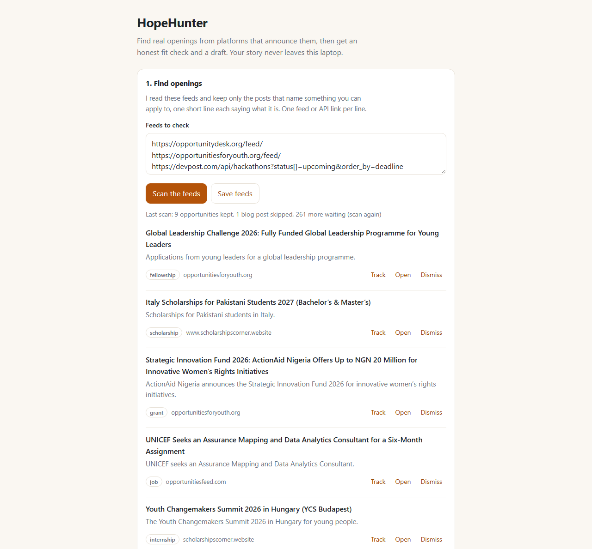
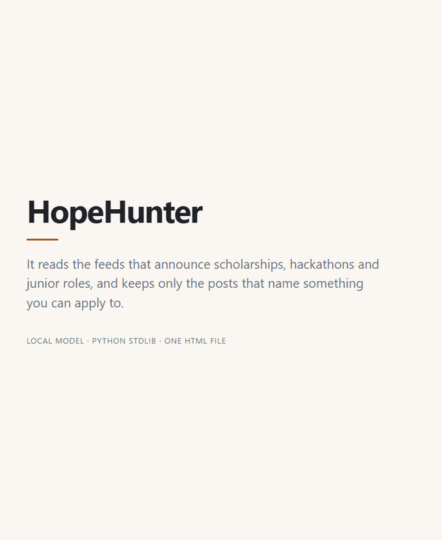
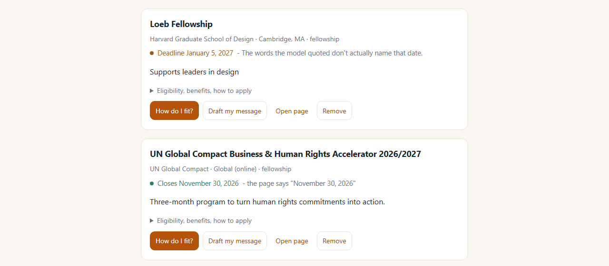
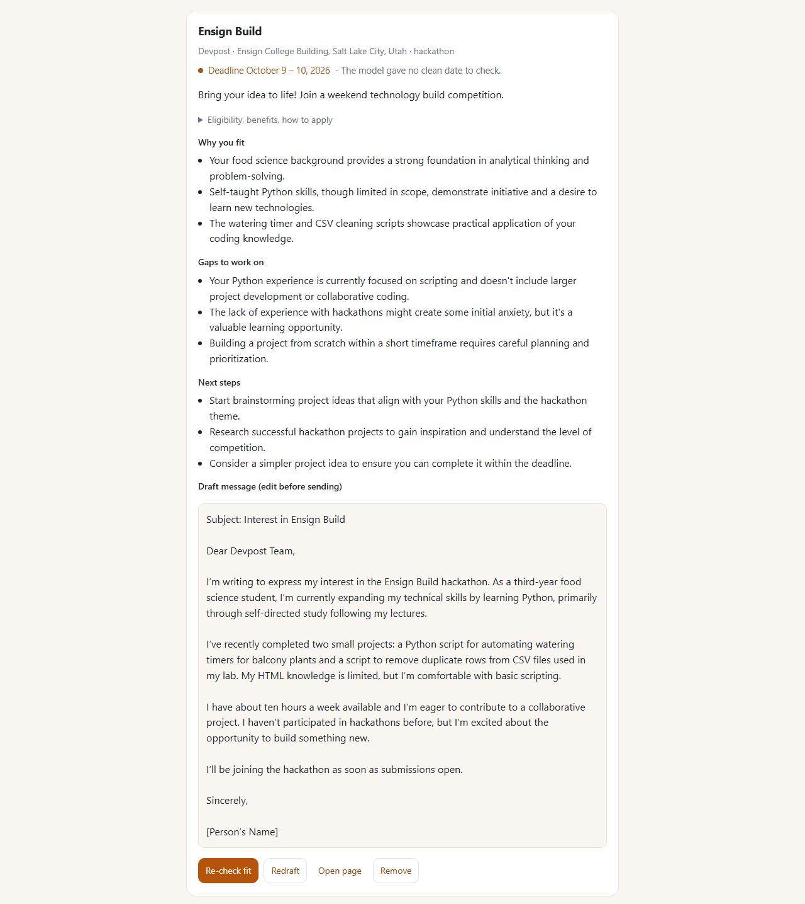

*This is a submission for the [Hacktoberfest Weekend Challenge: Build for a Friend](https://dev.to/challenges/hacktoberfest-weekend-2026-10-01)*

## What I Built

I built this for Zohaib, who has sent me 400 links over the years. "You should apply for this." Scholarships, hackathons, junior roles, fellowships, grants. Half of them expired the week they arrived. The rest needed a page-by-page read of the eligibility rules before you could tell whether they were even for someone like me.

So I asked him a question back: you're always asking where I find these — what if there were a tool that searched and just handed you the curated list? His answer was the entire brief: **"Damn, that would be great."** He hasn't run it yet. That's the real state of things: a working tool on my laptop, waiting for the person it was built for.

HopeHunter scans opportunity feeds, reads a posting with a small language model running on my laptop, pulls out the deadline, tells him honestly what fits and what is missing, and drafts the message he'd send. His work history never leaves the machine.



## Demo

The whole task on one card, fifteen seconds: scroll to a tracked hackathon, ask how the person fits, ask for the message. The background on screen is one I wrote for this recording, not my friend's.



There is no deployed link, and that is the point: it runs on the person's own laptop, on their own GPU. Two commands:

```bash
ollama pull gemma3:4b
python app.py          # then open http://127.0.0.1:8000
```

Python 3.9+, nothing to install, no account, no key. 103 tests run offline in under half a second.

## Code

Repo: [github.com/Burry071/hopehunter](https://github.com/Burry071/hopehunter). One Python file that uses nothing but the standard library, and one HTML file. MIT. The full write-up, with all eight mistakes spelled out, is [`ARTICLE.md`](https://github.com/Burry071/hopehunter/blob/main/ARTICLE.md) in the repo.



## How I Built It

The model is [Gemma 3 4B](https://ollama.com/library/gemma3), run locally through Ollama, and I ask it for four separate things: screen a post, extract a page, compare that page against the person's background, draft the message. Everything below came from watching it do those four things.

Start with the machine: an i5-8400H with a Quadro P2000, 4 GB of VRAM, Pascal architecture. Every request came back HTTP 500 with `the provided PTX was compiled with an unsupported toolchain`, which is an upstream Ollama bug with these cards and not mine. `OLLAMA_VULKAN=1` gets around it, and it runs about **11 tokens per second** with 1.9 of 3.8 GB resident on the card. Slow, but it answers.

### Eight times the app looked fine and was wrong

**It printed a deadline the page never showed.** A small model will invent a plausible date, and on a tool about deadlines that one error costs a person their only real chance. So the app does not trust the field. It looks for that exact date in the page text, inside a sentence containing deadline-ish words, and checks that the model's own quoted sentence names it. If either fails, the card says *not checked*. Dates written like `03/11/2026` are never trusted at all, because I cannot tell whether that is March or November.

The version I nearly shipped threw away a real date instead. The Loeb Fellowship page prints *January 5, 2027* under a heading that says Application Deadlines. The model quoted those exact words and left its ISO field empty, so the app gave up with *the model gave no clean date to check* - an excuse about a date it could have looked up. Month-name dates get checked now. A phrase with no year in it, like *end of November*, still does not: turning that into a day would mean inventing the one thing the app exists to verify.



**A fit score that meant nothing.** I gave one hackathon post to two backgrounds: one a perfect fit, one with no coding experience at all and no time. Both scored **1 out of 100**. Same number, same sentence. The coach did the same thing, **0/100** for both.

Ask a 4-billion-parameter model for a number between 0 and 100 and that is what you get. So there is no score anywhere now, and the scan stopped looking at who you are: finding openings and judging fit are two different questions, and only the second one needs a person. The fit check and the draft still ask for your background and answer in words. On those same two backgrounds it writes things like *your open source projects make you overqualified for a hackathon aimed at beginners* - a judgement you can disagree with, which is more than a bare 1/100 ever gave me.



**Ten lines that all said "Couldn't read".** I pasted a longer list of sites into the feeds box - GitHub, Devfolio, Unstop, HackerEarth - and hit scan. Ten lines came back, every one starting *Couldn't read*, and under them a feed the app had filled from the sources that worked. One message, two different problems. GitHub answered in half a second with a page full of HTML; the app tried to parse it as XML, failed, and called the site unreadable. Nothing was unreadable. I had pasted homepages into a box that wants feeds, and the message blamed the network instead of me.

Now the app asks the page. When a URL is not a feed it reads that page's `<head>` for the feed it advertises, and if the page says nothing it tries `/feed/` and `/rss.xml`. When one of those works it rewrites the saved source to the feed address, so the next scan goes straight there. Two of my ten upgraded themselves on the spot, and the other eight finally said what was wrong: *https://github.com is a web page with no feed on it. Add the site's feed or API link, or paste one opening into "Add one yourself".* Devpost's homepage genuinely has no feed but its hackathon API does, and the old message made those two look identical.

The other five, briefly:

- **It renamed my fields.** I asked in prose for `title`, `organization`, `deadline` and got `name`, with the deadline nested inside an object. A JSON Schema fixed the shape - but a live scan still came back with `Accelerator` and `essay award` in a field whose enum allows exactly seven words, so the last check is mine.
- **It gave me advice that was wrong about my own machine.** Every request was dying on that CUDA crash and the app told me to run `ollama pull gemma3:4b`. Already installed. It keeps and shows the server's own words now.
- **I fed it blog posts and blamed the model.** Three of my default feeds were DEV tag feeds, which list posts *about* hackathons rather than hackathons. One scan kept six items, all six from DEV, and none of them something you could apply to. Deleting those feeds did more for the output than anything else I did that week.
- **Adding a site changed nothing.** The queue read feeds top-down and stopped after ten posts, so anything below the first two was never asked a question - and every scan still returned ten items, so it looked fine. Round-robin fixed it: the first pass after the change kept seven openings from six different sites.
- **Telling the model to stop was not making it stop.** I put "Do not write about the post" in the prompt, and four of nine cards still read *"Post announces the HACK PRADESH - RVIT Hackathon for participants."* So the app cuts that clause itself: a container word plus its reporting verb at the start of a line, deleted.

A schema is a request. A prompt sentence is a request. The only thing I can rely on is the check the app runs itself, after the model has finished being persuasive.

### What I measured instead of guessing

I assumed long pages were the problem and started writing chunking code. Then I benchmarked it: of the 36 seconds it takes to read one page, the model spends **about 2 seconds reading** and **18 writing**. Prefill was never the bottleneck.

So the speed work went to the feeds, which are network waits. With five of them that went from **31.5 seconds to 4.7**. Then I kept adding feeds until there were eleven and re-measured: **23 to 43 seconds in parallel against 27 to 29 one after another** - no win, sometimes slower, because one feed is a 2.2 MB job listing that takes 14 seconds by itself and ten other threads on one wire do not make that shorter. Asking for shorter replies took one answer from 201 tokens to 163, and raising the read cap gave back **89 jobs**, because the cap had been silently truncating that same 2.2 MB feed since the day I added it.

The GIF above was recorded against a scripted stand-in that answers with the words a real Gemma run already produced for that card, so I did not have to wait on an 11-token GPU to film it. It lives in `dev/` with the fixtures it reads.

### What it still cannot do

- About a minute per scan of ten posts, because it is one 4 GB GPU from 2017.
- The filter misses things, and the misses are not random: a press release about an organisation came through tagged `internship`, and a roundup of seven scholarships became one.
- Only about 7,000 characters of a page reach the model, taken from the top and the bottom.
- A page behind a login has to be pasted in as text, and it cannot tell you whether you got the thing.

## Why Does Open Innovation Matter?

A CV is the most personal document most people own. Sending it to an API means sending it to a company whose terms you did not read, to a server you will never see, along with your name and email address. For a tool whose entire job is "read my friend's history and judge it", that is the wrong shape. An open-weight model on the laptop keeps the one sensitive input in the one place it belongs.

Three more things came out of that choice: **a scan costs nothing** (about ten model calls, and on a hosted API I would have been paying to re-read blog posts the app throws away); **it works offline** except for fetching the pages you asked for; and **I can change the model**, same app, different `OLLAMA_MODEL`, which mattered a lot on a 2017 GPU. The closed version was not available to me at any price - here the model is a file on disk that I can point at Vulkan when its CUDA backend crashes on a nine-year-old card.

## My Agent Session

Not uploaded. The transcript of building this has my friend's real CV in it, and the point of the project is that those words stay on one laptop. What the agent did, and the eight places its first answer was wrong, is in the section above; the tooling it wrote for itself is in `dev/`.

## Prize Categories

**Best Use of Gemma.** Gemma 3 4B is the model the app is built around: it screens the feeds, reads the pages, writes the fit check and the draft. There is no other AI in the loop, and the whole design is what a 4-billion-parameter model on a 4 GB card from 2017 can and cannot be trusted with.

## What I got out of it

First Hacktoberfest, and I went in wanting experience rather than a prize. What I got is a rule I did not have before: **a model's confidence is not evidence.** Every one of those eight failures looked like success while I was watching it, and the only thing that caught them was checking one specific claim against the source it came from.

And Zohaib has a tool that reads his feeds on a laptop sitting in the same room he does, with nothing about him sent anywhere.
